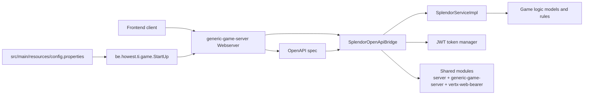

<div align="center">

# 🛰️ Splendor Server

**A Vert.x-based Java backend for the Splendor game, driven by an OpenAPI contract and shared game logic.**

<p>
  
  
  
  
  
  
</p>

</div>

> 🎓 Created for the Howest 2024-2025 programming project, group 11.

## 📑 Table of Contents

- [📖 About](#about)
- [🏗️ Architecture](#architecture)
- [✨ Features](#features)
- [🛠️ Tech Stack](#tech-stack)
- [🚀 Getting Started](#getting-started)
- [📡 API & Infrastructure](#api--infrastructure)
- [👤 Author](#author)

## 📖 About

- This repository contains the backend server for the Splendor game.
- The server is built as a multi-module Gradle project around Vert.x and an OpenAPI specification.
- The main verticle loads runtime config from `src/main/resources/config.properties`, starts an HTTP server, and routes requests through an OpenAPI bridge into the game logic layer.

## 🏗️ Architecture



## ✨ Features

- OpenAPI-driven HTTP server with Vert.x routing.
- JWT-based player authentication and request validation.
- Game creation, lobby management, spectating, and gameplay actions.
- Shared logic split across dedicated Gradle modules.
- Test, coverage, and fat-jar build support.

## 🛠️ Tech Stack

| Area | Technologies |
| --- | --- |
| Language | Java 21 |
| Build tool | Gradle |
| Web framework | Vert.x |
| API contract | OpenAPI |
| Serialization | Jackson |
| Authentication | java-jwt, custom bearer auth module |
| Testing | JUnit 5, Vert.x test utilities |
| Coverage | JaCoCo |

## 🚀 Getting Started

### Prerequisites

- Java 21
- A shell capable of running the Gradle wrapper
- The OpenAPI spec URL referenced by the server config

### Clone

```bash
git clone git@gitlab.ti.howest.be:ti/2024-2025/s2/programming-project/students/group-11/server.git
cd server
```

### Configuration

The runtime config is loaded from [server/src/main/resources/config.properties](server/src/main/resources/config.properties). The checked-in template is [server/src/main/resources/_config.properties](server/src/main/resources/_config.properties).

| Variable | Description |
| --- | --- |
| `server.port` | Port used by the Vert.x HTTP server. |
| `group.secret` | Shared secret required by the API bridge. |
| `spec.url` | URL of the OpenAPI specification used to build the router. |

### Run

```bash
./gradlew :server:test
./gradlew :server:run
```

### Build a fat JAR

```bash
./gradlew :server:shadowJar
```

<!-- TODO: add a verified local development command if one is introduced later. -->

## 📡 API & Infrastructure

### API Endpoints

The backend is contract-driven, and the following routes are implemented in the Splendor bridge layer.

| Method | Route | Description |
| --- | --- | --- |
| `GET` | `/gems` | Returns gem data for the client. |
| `GET` | `/nobles` | Returns all nobles. |
| `GET` | `/developments` | Returns all development cards. |
| `GET` | `/games` | Lists games, with filtering for started and unstarted games. |
| `POST` | `/games` | Creates a public or private game. |
| `GET` | `/games/{gameId}` | Returns game details when the requester is authorized. |
| `POST` | `/games/{gameId}/players/{playerName}` | Joins, spectates, or leaves a game depending on the request body. |
| `PATCH` | `/games/{gameId}/players/{playerName}/tokens` | Updates player tokens. |
| `POST` | `/games/{gameId}/players/{playerName}/developments` | Buys a development card. |
| `POST` | `/games/{gameId}/players/{playerName}/reserve` | Reserves a development card by level or name. |
| `DELETE` | `/games/{gameId}/players/{playerName}/reserve/{cardName}` | Buys a reserved development card. |
| `POST` | `/games/{gameId}/players/{playerName}/nobles` | Claims a noble. |

<!-- TODO: verify the exact DELETE route for the `delete-games` operation against the external OpenAPI spec before documenting it here. -->

### Infrastructure Notes

- The root Vert.x server is started by [server/src/main/java/be/howest/ti/game/StartUp.java](server/src/main/java/be/howest/ti/game/StartUp.java).
- The HTTP server and request logging live in `generic-game-server`.
- The OpenAPI bridge installs CORS, body handling, bearer auth, and failure mapping.


## 👤 Authors

| Name | GitHub | LinkedIn |
| --- | --- | --- |
| Maurice De Kegel | [MriceDK](https://github.com/MriceDK) | [LinkedIn](https://www.linkedin.com/in/dekegelmaurice/) |
| Simon Cornelissis | [SCornelissis](https://github.com/scornelissis) | [LinkedIn](https://www.linkedin.com/in/simon-cornelissis/) |
| Yoni Furniere | [real-yoni-furniere](https://github.com/real-yoni-furniere) | [LinkedIn](https://www.linkedin.com/in/yoni-furniere-30103a34b/) |
| Ruben Lescouhier | - | [LinkedIn](https://www.linkedin.com/in/ruben-lescouhier-9840011a2/) |
| Lars Patrouille | [LarsPatrouille](https://github.com/LarsPatrouille) | [LinkedIn](https://www.linkedin.com/in/lars-patrouille-4205493aa/) |
| Rune Mortier | - | [LinkedIn](https://www.linkedin.com/in/rune-mortier-88ba30395/) |
